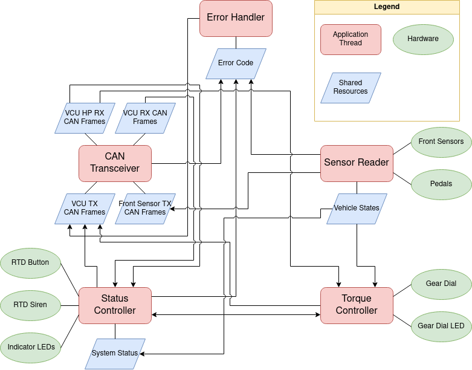

# nturt_stm32_front_box

## Introduction

Software architecture.

## Peripheral Configuration

### GPIO

- Pins are denoted as `PIN`, e.g. `5V`, `PA0`, etc.

#### Button (pull-down)

- BUTTON_RTD -> GPIO `PE15`
- GEAR_HIGH -> GPIO `PE8`
- GEAR_REVERSE -> GPIO `PE12`

#### Microswitch (pull-down)

- MICRO_APPS -> GPIO `PE9`
- MICRO_BSE -> GPIO `PF2`

#### Hall Sensor (pull-down)

- HALL_L -> GPIO `PF3`
- HALL_R -> GPIO `PC8`

#### LED

###### In Box

- LED_WARN -> GPIO `PC9`
- LED_ERROR -> GPIO `PC12`
- LED_CAN_TX -> GPIO `PG2`
- LED_CAN_RX -> GPIO `PG3`

###### On Dashboard

- LED_VCU -> GPIO `PE7`
- LED_RTD -> GPIO `PA0`
- LED_Gear -> GPIO `PE13`

#### Other

- SIREN_RTD -> GPIO `PD0`

### ADC

#### Pedal

- APPS1 -> ADC1 IN5 `PB1`
- APPS2 -> ADC3 IN0 `PC2_C`
- BSE -> ADC3 IN6 `PF10`

#### Sunspension Travel

- SUSPENSION_L -> ADC3 IN8 `PF6`
- SUSPENSION_R -> ADC1 IN15 `PA3`

#### Oil Pressure

- OIL_PRESSURE -> ADC1 IN18 `PA4`

#### Strain Guage

- STRAIN -> ADC1 IN19 `PA5`

### I2C

#### Temperature Sensor (as master)

- TEMP_L `SCL` -> I2C1 `PB8`
- TEMP_L `SDA` -> I2C1 `PB9`
- TEMP_R `SCL` -> I2C5 `PC10`
- TEMP_R `SDA` -> I2C5 `PC11`

#### Rapspberry Pi (as slave)

- RPI `SCL` -> I2C2 `PF0`
- RPI `SDA` -> I2C2 `PF1`

### SPI

#### Steering Encoder

- ENCODER `SCK` -> SPI4 `PE2`
- ENCODER `MISO` -> SPI4 `PE5`
- ENCODER `MOSI` -> SPI4 `PE6`
- ENCODER `SS` -> GPIO `PE4`

### CAN

- `TX` -> FDCAN3 `PD13`
- `RX` -> FDCAN3 `PD12`

## Appendix

### Pinout

*The pinout is the same as nucleo-h743gz2*

#### Zio and Arduino-compatible headers

#### CN11 CN12 headers

